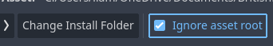
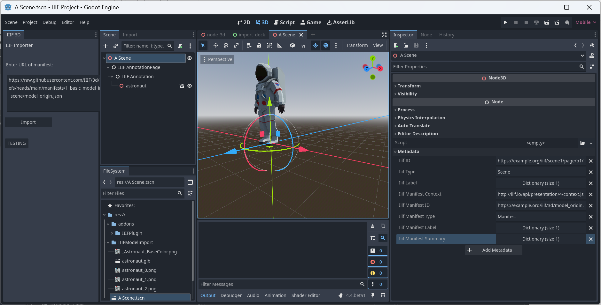

# godot-iiif-importer
 Experimental Godot Addon to import IIIF 3D manifests

Extremely experimental IIIF importer for Godot 4.4 and above. 

## Installation

Follow the instllation instructions at:
https://docs.godotengine.org/en/stable/tutorials/plugins/editor/installing_plugins.html

So for this repository:

* Click the green "<> Code" button to access a drop down menu
* Click on Download ZIP and remember where you put it
* In Godot, open a project and go the "AssetLib"
* Click on "Import" and select your zip
* IMPORTANT: Make sure "Ignore Asset Root" is ticked
* After the plugin has been imported to you project click "Plugins" on the AssetLib window
* Click "On" next to the IIIF entry

## Usage
* A new panel should open on the left hand side of Godot, paste into the panel a URL of a IIIF 3D manifets file, e.g. https://raw.githubusercontent.com/IIIF/3d/refs/heads/main/manifests/1_basic_model_in_scene/model_origin.json.
* If you are copying a URL from GitHub, be sure to click the "Raw" button first to get the JSON file

## Screenshot

# Progress 

Here is how the importer is doing with the example 3D manifests (thanks to [MorphoSource for this list idea](https://github.com/MorphoSource/Community/blob/master/IIIF4.md)! )

| Manifest | Works? | 
| :--- | :---: | 
| 1. Basic model in scene | |
| [Single Model](https://raw.githubusercontent.com/IIIF/3d/main/manifests/1_basic_model_in_scene/model_origin.json) | ✅ | 
| [Single Model with background color](https://raw.githubusercontent.com/IIIF/3d/main/manifests/1_basic_model_in_scene/model_origin_bgcolor) |  ✅  | 
| 4. Transform and position | |
| [Single Positioned Model](https://raw.githubusercontent.com/IIIF/3d/main/manifests/4_transform_and_position/model_position.json) | ✅ | 
| [Rotated Model](https://raw.githubusercontent.com/IIIF/3d/main/manifests/4_transform_and_position/model_transform_rotate_position.json) | ✅  | 
| [Rotated Translated Model](https://raw.githubusercontent.com/IIIF/3d/main/manifests/4_transform_and_position/model_transform_rotate_translate_position.json) | ✅ | 
| [Translated Rotated Model](https://raw.githubusercontent.com/IIIF/3d/main/manifests/4_transform_and_position/model_transform_translate_rotate_position.json) | ✅  | 
| [Two Models with Scaling and Positioning](https://raw.githubusercontent.com/IIIF/3d/main/manifests/4_transform_and_position/model_transform_translate_scale_position.json) | ✅  |
| [Two Models with Translation, Scaling, and Positioning](https://raw.githubusercontent.com/IIIF/3d/main/manifests/4_transform_and_position/model_transform_scale_position.json) | ✅ | 
| [Two Models with Scaling, Translation, and Positioning](https://raw.githubusercontent.com/IIIF/3d/main/manifests/4_transform_and_position/model_transform_scale_translate_position.json) | ✅| 
| [Two Models with Left-Right Mirroring and Positioning](https://raw.githubusercontent.com/IIIF/3d/main/manifests/4_transform_and_position/model_transform_negative_scale_position.json) | ✅ | 
| [Whale Cranium and Mandible Positioned](https://raw.githubusercontent.com/IIIF/3d/main/manifests/4_transform_and_position/whale_cranium_and_mandible_position.json) |✅  | 
| 9. Commenting Annotations | |
| [Single Model with Comment Annotations](https://raw.githubusercontent.com/IIIF/3d/main/manifests//9_commenting_annotations/astronaut_comment.json) | ❌ |
| 10. Content State | |
| [Single Model with Comment Annotations and Custom Views Per Annotation](https://raw.githubusercontent.com/IIIF/3d/astronaut_comment_scope/manifests/10_content_state/astronaut_comment_scope.json) | ❌ | 
| [Whale Cranium and Mandible with Manifest-Level Comment Annotations](https://raw.githubusercontent.com/IIIF/3d/main/manifests/10_content_state/whale_comment_scope_content_state.json) | ❌ |

Have fun!
